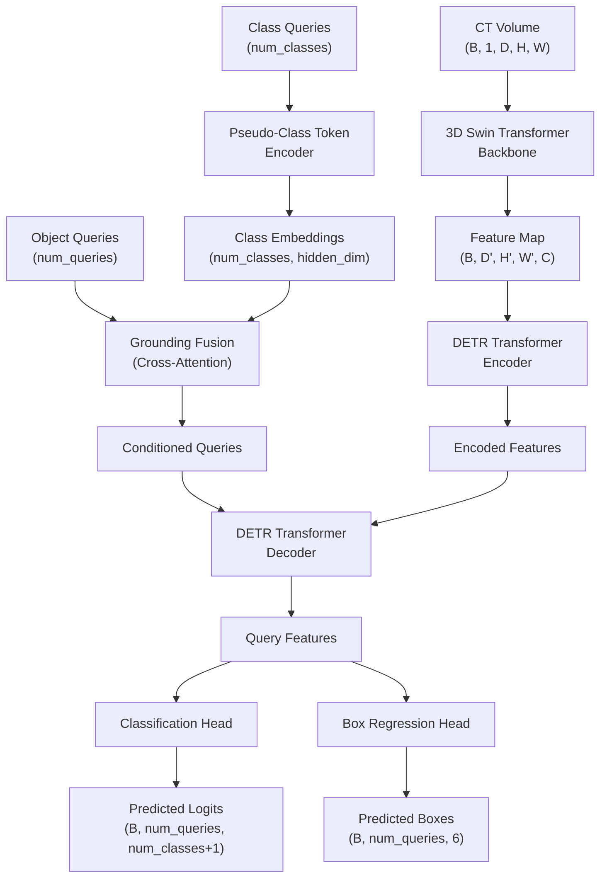
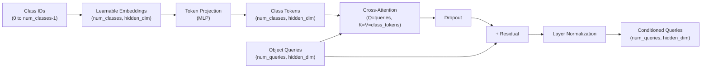
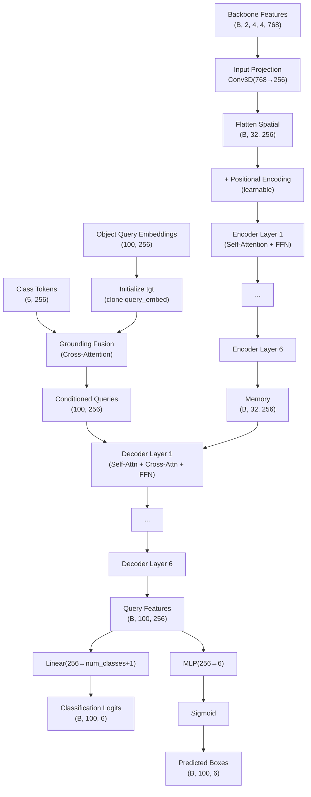
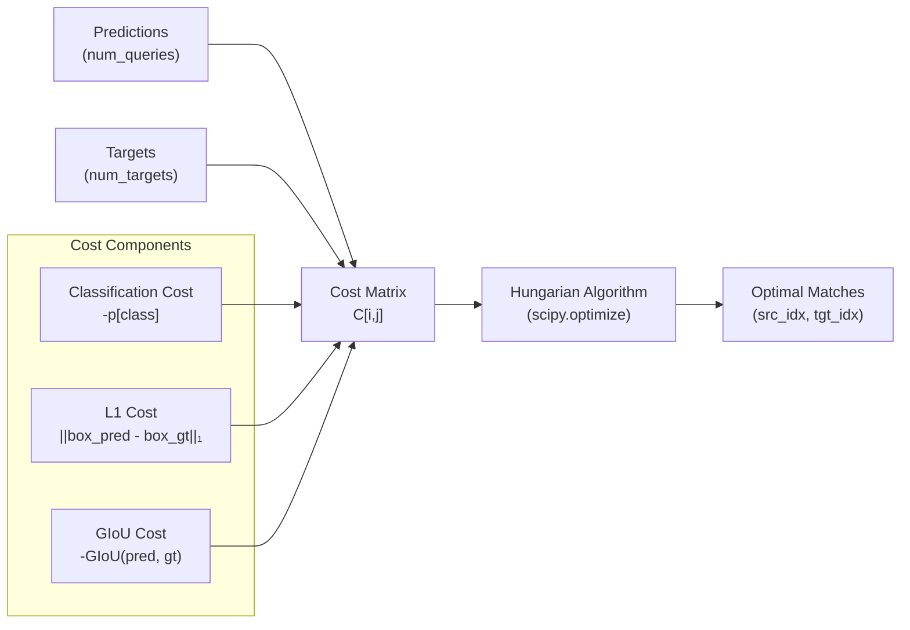
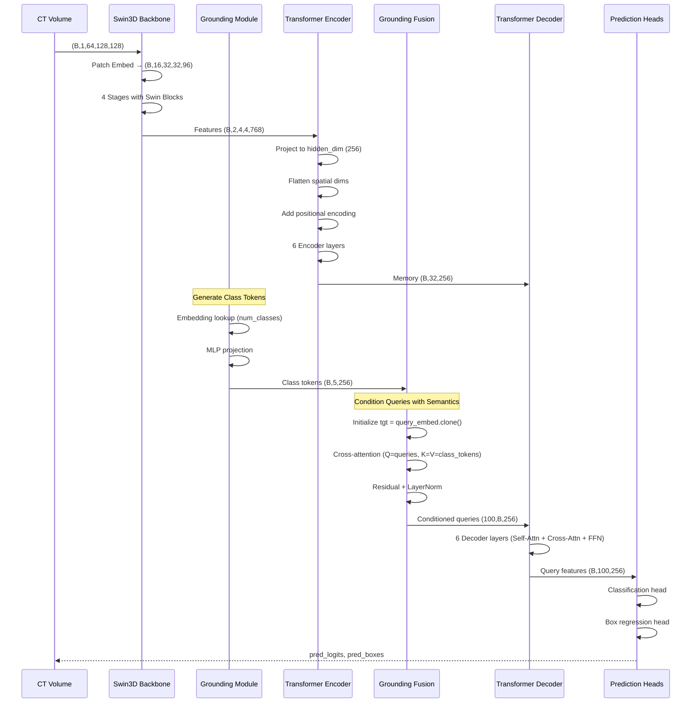

# 3D Grounding-DETR Architecture

## Overview

This document describes the complete architecture of the 3D Grounding-DETR model for volumetric object detection in CT scans. The model combines hierarchical 3D feature extraction, transformer-based detection, and grounding-style category conditioning.

---

## High-Level Architecture



---

## Component Details

### 1. 3D Swin Transformer Backbone

**Purpose**: Hierarchical feature extraction from 3D CT volumes

**Architecture**:
```
Input Volume (1, 64, 128, 128)
    ↓
Patch Embedding (96 channels)
    → Patch size: 4×4×4
    → Output: (16, 32, 32, 96)
    ↓
Stage 1: 2 Swin Blocks (96 channels)
    → Window size: 7×7×7
    → 3 attention heads
    ↓
Patch Merging → (8, 16, 16, 192)
    ↓
Stage 2: 2 Swin Blocks (192 channels)
    → 6 attention heads
    ↓
Patch Merging → (4, 8, 8, 384)
    ↓
Stage 3: 6 Swin Blocks (384 channels)
    → 12 attention heads
    ↓
Patch Merging → (2, 4, 4, 768)
    ↓
Stage 4: 2 Swin Blocks (768 channels)
    → 24 attention heads
    ↓
Output Features: (B, 2, 4, 4, 768)
```

**Key Components**:
- **PatchEmbed3D**: Converts volume to patch embeddings
- **WindowAttention3D**: Self-attention within 3D windows
- **SwinTransformerBlock3D**: Standard Swin block with window attention + MLP
- **PatchMerging3D**: Downsamples by merging 2×2×2 patches

**Parameters**:
```python
depths = [2, 2, 6, 2]           # Blocks per stage
num_heads = [3, 6, 12, 24]      # Attention heads per stage
embed_dim = 96                   # Initial embedding dimension
window_size = (7, 7, 7)         # 3D window size
mlp_ratio = 4.0                 # MLP hidden dim multiplier
```

---

### 2. Grounding Module

**Purpose**: Generate category-aware embeddings and fuse them with object queries



**Components**:

1. **PseudoClassTokenEncoder**:
   - Learnable embeddings for each class (`nn.Embedding(num_classes, hidden_dim)`)
   - MLP projection for feature transformation
   - Generates class-specific semantic prototypes
   - Replaces full text encoder (BERT-style) for MVP simplicity

2. **Grounding Fusion (in DETR3DHead)**:
   - Multi-head cross-attention: queries attend to class tokens
   - Applied **once before decoder layers** (not in each layer)
   - Residual connection + dropout for stable training
   - Layer normalization for training stability

**Integration Flow**:
1. Generate class tokens for all classes
2. Object queries initialized with learnable embeddings
3. **Fusion step**: Queries cross-attend to class tokens
4. Conditioned queries enter decoder layers

**Parameters**:
```python
num_classes = 5
hidden_dim = 256
num_heads = 8  # For fusion attention
```

---

### 3. DETR 3D Detection Head

**Purpose**: Transform features to object predictions using transformers



**Encoder**:
- 6 transformer encoder layers
- Self-attention over flattened spatial features
- Feed-forward network (MLP) with expansion factor 8
- Dropout rate: 0.1

**Decoder**:
- **Query Initialization**: `tgt = query_embed.clone()` (learnable, unique per query)
- **Grounding Fusion** (optional, before decoder layers):
  - Cross-attention between queries and class tokens
  - Only applied when `use_grounding_fusion=True`
- 6 transformer decoder layers:
  - Self-attention over object queries
  - Cross-attention to encoder memory
  - Feed-forward network
- 100 learnable object queries

**Prediction Heads**:
```python
# Classification head
class_embed = Linear(hidden_dim, num_classes + 1)  # +1 for background

# Box regression head (MLP with 3 layers)
bbox_embed = MLP(
    input_dim=hidden_dim,
    hidden_dim=hidden_dim,
    output_dim=6,  # (cx, cy, cz, w, h, d)
    num_layers=3
)
# Sigmoid activation for normalized coordinates [0, 1]
```

---

### 4. Loss Functions

**Hungarian Matching**:


**Set-Based Criterion**:
```python
total_loss = (
    λ_ce × classification_loss +
    λ_l1 × bbox_l1_loss +
    λ_giou × bbox_giou_loss
)
```

**Loss Weights** (default):
- Classification: 2.0
- L1: 5.0
- GIoU: 2.0
- Background class weight (eos_coef): 0.1

---

## Complete Forward Pass

### Input/Output Specifications

**Input**:
- Shape: `(batch_size, 1, D, H, W)`
- Type: `torch.float32`
- Range: `[0, 1]` (normalized CT intensities)
- Default size: `(B, 1, 64, 128, 128)`

**Output**:
```python
{
    'pred_logits': Tensor(B, num_queries, num_classes+1),  # Classification scores
    'pred_boxes': Tensor(B, num_queries, 6),               # Normalized 3D boxes
    'class_tokens': Tensor(B, num_classes, hidden_dim)     # Class embeddings (optional)
}
```

**Box Format**: `(cx, cy, cz, w, h, d)` normalized to `[0, 1]`
- `cx, cy, cz`: Center coordinates
- `w, h, d`: Width, height, depth

---

### Detailed Forward Pass Flow



---

## Model Statistics

### Parameter Count

**Default Configuration**:
```
3D Swin Transformer Backbone:  ~35.7M parameters
DETR Head:                     ~10.2M parameters
Grounding Module:              ~1.5M parameters
─────────────────────────────────────────────
Total:                         ~47.4M parameters
```

**Parameter Breakdown**:
- Patch embedding: 0.1M
- Swin stages: 35.6M
  - Stage 1 (96 channels): 0.5M
  - Stage 2 (192 channels): 2.1M
  - Stage 3 (384 channels): 16.8M
  - Stage 4 (768 channels): 16.2M
- Transformer encoder: 6.3M
- Transformer decoder: 3.8M
- Prediction heads: 0.1M
- Grounding module: 1.5M

### Computation

**FLOPs** (approximate, for 64×128×128 input):
- Backbone: ~450 GFLOPs
- Encoder: ~18 GFLOPs
- Decoder: ~25 GFLOPs
- **Total**: ~493 GFLOPs per forward pass

**Memory** (training with batch_size=2):
- Model parameters: ~190 MB
- Activations (forward): ~2.5 GB
- Gradients (backward): ~380 MB
- Optimizer states (AdamW): ~380 MB
- **Peak**: ~3.5 GB

---

## Configuration

### Model Hyperparameters

```yaml
model:
  # Backbone
  backbone_embed_dim: 96
  backbone_depths: [2, 2, 6, 2]
  backbone_num_heads: [3, 6, 12, 24]
  
  # DETR Head
  hidden_dim: 256
  num_queries: 100
  num_encoder_layers: 6
  num_decoder_layers: 6
  num_heads: 8
  dim_feedforward: 2048
  dropout: 0.1
  
  # Task
  num_classes: 5
  
  # Grounding
  use_grounding: true
```

### Training Configuration

```yaml
training:
  lr: 1e-4
  weight_decay: 1e-4
  epochs: 100
  warmup_epochs: 5
  clip_max_norm: 0.1
  
loss:
  weight_ce: 2.0
  weight_l1: 5.0
  weight_giou: 2.0
  eos_coef: 0.1
  
  cost_class: 1.0
  cost_bbox: 5.0
  cost_giou: 2.0
```

---

## Design Decisions

### 1. Simplified Grounding Module

**Decision**: Use learnable pseudo-class token embeddings instead of full text encoder (BERT/CLIP)

**Rationale**:
- Reduces model complexity for MVP
- Maintains grounding-style architecture concept
- Faster training and inference
- Can be upgraded to full text encoder later

### 2. 3D Window Attention

**Decision**: 7×7×7 window size for Swin Transformer

**Rationale**:
- Balances local and global information
- Manageable computational cost
- Proven effective in 2D vision tasks

### 3. Hungarian Matching

**Decision**: Use Hungarian algorithm for bipartite matching

**Rationale**:
- Standard in DETR literature
- Handles variable number of objects elegantly
- Avoids need for anchor boxes and NMS
- Enables set-based training

### 4. Normalized Coordinates

**Decision**: All box coordinates in [0, 1] range

**Rationale**:
- Scale-invariant across different volume sizes
- Simplifies loss computation
- Standard practice in detection models

### 5. Grounding Fusion Placement

**Decision**: Apply grounding fusion once before decoder layers, not within each layer

**Rationale**:
- **Simplicity for MVP**: Single fusion step is easier to implement and debug
- **Computational efficiency**: Reduces overhead compared to per-layer fusion
- **Sufficient for initial experiments**: Queries get semantic conditioning before refinement
- **Upgrade path**: Can be extended to per-layer fusion in future iterations

**Implementation Details**:
- Fusion uses multi-head cross-attention (8 heads)
- Applied after query initialization, before first decoder layer
- Includes residual connection and layer normalization
- Only active when `use_grounding_fusion=True`

### 6. Query Initialization

**Decision**: Initialize decoder queries with `query_embed.clone()` instead of zeros

**Rationale**:
- **Unique queries**: Each query has distinct learnable initialization
- **Prevents collapse**: Zero initialization causes all queries to be identical
- **Spatial specialization**: Different queries can learn to focus on different regions
- **Standard practice**: Matches original DETR implementation

---

## References

**Key Papers**:
1. Swin Transformer: Liu et al., "Swin Transformer: Hierarchical Vision Transformer using Shifted Windows", ICCV 2021
2. DETR: Carion et al., "End-to-End Object Detection with Transformers", ECCV 2020
3. Grounding DINO: Liu et al., "Grounding DINO: Marrying DINO with Grounded Pre-Training for Open-Set Object Detection", arXiv 2023

**Implementation Details**:
- Based on PyTorch 2.1.0
- Uses standard transformer architecture from torch.nn
- Custom 3D adaptations for medical imaging

---

## Appendix: Module APIs

### SwinTransformer3D
```python
model = SwinTransformer3D(
    in_channels=1,
    patch_size=(4, 4, 4),
    embed_dim=96,
    depths=[2, 2, 6, 2],
    num_heads=[3, 6, 12, 24],
    window_size=(7, 7, 7)
)
# Input: (B, 1, D, H, W)
# Output: (B, D', H', W', C)
```

### DETR3DHead
```python
head = DETR3DHead(
    hidden_dim=256,
    num_queries=100,
    num_classes=5,
    num_encoder_layers=6,
    num_decoder_layers=6,
    backbone_dim=768,
    use_grounding_fusion=True  # Enable grounding fusion
)
# Input: 
#   - features: (B, C, D', H', W') from backbone
#   - class_tokens: (B, num_classes, hidden_dim) [optional]
# Output: (pred_logits, pred_boxes)
```

### GroundingDETR3D
```python
model = build_model(config)
# Input: (B, 1, D, H, W)
# Output: dict(pred_logits, pred_boxes, class_tokens)
# 
# When use_grounding=True:
#   - Generates class tokens
#   - Applies grounding fusion before decoder
#   - Returns class_tokens in output dict
```
