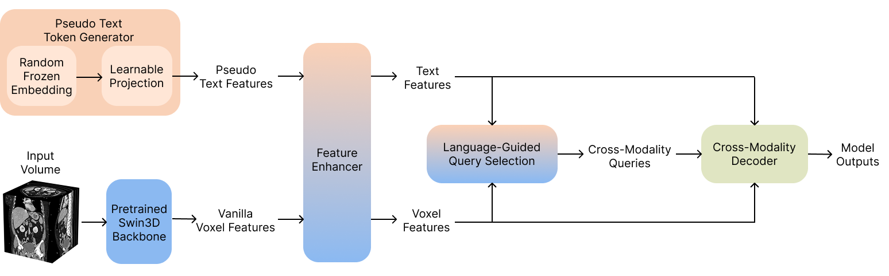
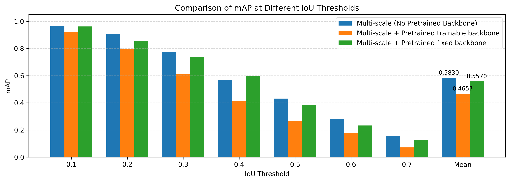

# Pseudo-Text‑Conditioned 3D Grounding DINO for Organ Localization in Abdominal CT

A 3D object detection framework for volumetric CT scans, adapting the
Grounding-DINO architecture to medical imaging. It combines a 3D Swin
Transformer backbone, a DETR-style decoder, and grounding-style supervision
with pseudo-class tokens (replacing the text encoder for a fixed set of
medical categories).



**Contact:** [siqi.chen@fau.de](mailto:siqi.chen@fau.de) ·
[han.gong@fau.de](mailto:han.gong@fau.de) ·
[keyi.hou@fau.de](mailto:keyi.hou@fau.de) ·
[jingxuan.yang@fau.de](mailto:jingxuan.yang@fau.de)

---

## Features

### Data Pipeline
- NIfTI segmentation loading with automatic 3D bounding-box extraction.
- Volumetric loading from DICOM (with HU conversion), JPEG, or pre-converted
  `.npz` arrays. A NumPy converter tool pre-processes DICOM to `.npz` for
  ~4x faster I/O.
- Intensity normalization for CT Hounsfield units.
- Proportional volume resizing based on `target_width` with trilinear
  interpolation, preserving aspect ratio.
- 3D data augmentation (rotation, scaling, elastic deformation, intensity
  jitter; no flipping, for anatomical correctness).
- PyTorch `Dataset` with a custom collate function for variable-length boxes
  and a configurable train/validation split.

### Model
- **3D Swin Transformer backbone** — 4-stage hierarchical feature extraction
  with patch embedding, window attention, and patch merging.
- **Pseudo text feature generator** — learnable class embeddings with an MLP
  projection, replacing the text encoder.
- **Feature enhancer** — bidirectional cross-attention between image and text
  features (self-attention, image↔text cross-attention, and FFN), with
  configurable depth.
- **Language-guided query selection** — currently fixed learnable queries
  (dynamic selection is planned).
- **Cross-modality decoder** — transformer decoder with dual cross-attention
  (text for category awareness, image for spatial localization) plus
  classification and box-regression heads.
- **End-to-end integration** producing class logits and 6D boxes
  `(cx, cy, cz, w, h, d)`.

### Training & Evaluation
- Hungarian matching with a combined loss (cross-entropy + box L1 + 3D GIoU)
  and configurable weights.
- AdamW with linear warmup and cosine annealing, gradient clipping, and
  checkpoint management (best/periodic/resume).
- 3D IoU and 3D mAP at multiple thresholds, with per-class AP.
- Visualization notebooks for data exploration and predictions.

---

## Installation

```bash
git clone https://github.com/SiqiChen9/3d-grounding-dino.git
cd 3d-grounding-dino

conda env create -f environment.yml
conda activate 3d-detection
```

All dependencies are declared in a single `environment.yml`. This works on
Linux, macOS, and Windows.

---

## Quick Start

### Test the implementation

```bash
python test_mvp.py
```

Validates data loading, the model forward pass, loss computation
(Hungarian matching + combined loss), and a training step.

### Explore the dataset

```bash
jupyter notebook datasets_visualization.ipynb
```

Volume slicing across axes, segmentation overlays, 3D box extraction, and data
statistics.

### Train

```bash
# Basic training
python train.py --config configs/default_config.yaml

# With a custom run name
python train.py --run-name my_experiment

# Debug mode (1 epoch only)
python train.py --debug
```

| Option | Description |
| --- | --- |
| `--config` | Path to config YAML (default: `configs/default_config.yaml`) |
| `--run-name` | Experiment name for logs and checkpoints |
| `--debug` | Run for 1 epoch (quick sanity check) |
| `--resume <ckpt>` | Resume from a checkpoint file |
| `--device <dev>` | `cuda`, `cpu`, or `cuda:0` |

Checkpoints are saved to `checkpoints/<run_name>/` and logs to
`logs/<run_name>/`.

### View training results

```bash
# List runs
python utils/plot_metrics.py --log-dir ./logs --list

# Plot a run (optionally save to a file)
python utils/plot_metrics.py --log-dir ./logs --run-name my_experiment --save training_metrics.png
```

Plots total loss, loss components (CE, L1, GIoU), the learning-rate schedule,
and gradient norm.

### Visualize predictions

```bash
jupyter notebook predictions_visualization.ipynb
```

Inference on validation samples, predicted vs. ground-truth boxes, multi-slice
views, and mAP / per-class AP at multiple IoU thresholds.

### Run the test suite

```bash
conda activate 3d-detection
pytest tests/ -v
```

| Category | Files | Coverage |
| --- | --- | --- |
| Models | 7 | Backbone, decoder, losses, and other core modules |
| Utils | 2 | Metrics (IoU, mAP) and visualization |
| Datasets | 1 | Preprocessing and augmentation |
| Integration | 1 | Full pipeline forward/backward pass |

---

## Configuration

All hyperparameters live in `configs/default_config.yaml`.

**Data** — `dataset_path`, `target_width` (proportional scaling, default 64),
`batch_size`, `num_workers`, `train_split`, `augment`, `image_format`
(`numpy` / `dcm` / `jpeg`; `numpy` is fastest and auto-converts from DICOM when
no `.npz` files are found).

**Model** — `num_classes`, `num_queries`, `hidden_dim`, `backbone_embed_dim`,
`backbone_depths`, `backbone_num_heads`, `num_encoder_layers` (feature
enhancer), `num_decoder_layers` (cross-modality decoder), `num_heads`,
`dim_feedforward`, `dropout`.

**Training** — `epochs`, `lr`, `weight_decay`, `warmup_epochs`,
`clip_max_norm`, `log_interval`, `val_interval`, `save_interval`.

**Loss** — matching costs (`cost_class`, `cost_bbox`, `cost_giou`), loss
weights (`weight_ce`, `weight_l1`, `weight_giou`), and `eos_coef`.

**Paths** — `checkpoint_dir`, `log_dir`.

```yaml
data:
  dataset_path: ./datasets
  target_width: 64
  batch_size: 2
  augment: false

model:
  num_classes: 5
  num_queries: 100
  hidden_dim: 256

training:
  epochs: 100
  lr: 0.001
  warmup_epochs: 5
```

---

## Architecture

1. **3D Swin Transformer backbone** — `(4,4,4)` patch embedding, 4 hierarchical
   stages with window attention and patch merging; output
   `(B, D/32, H/32, W/32, 256)`.
2. **Pseudo text feature generator** — learnable class embeddings + MLP
   projection; output `(B, num_classes, 256)`.
3. **Feature enhancer** — self-attention per modality plus cross-attention
   between image and text features.
4. **Cross-modality decoder** — per layer: self-attention on queries,
   text cross-attention, image cross-attention, and an FFN; prediction heads
   are a linear classifier and a 3-layer box-regression MLP.
5. **Loss** — Hungarian matching with
   `L = λ_ce·L_ce + λ_l1·L_l1 + λ_giou·L_giou`.

Boxes use normalized coordinates `(cx, cy, cz, w, h, d)` relative to volume
size.

---

## Results

3D detection mAP across IoU thresholds.



---

## Project Structure

```
3d-grounding-dino/
├── configs/                          # Hyperparameters and paths
├── datasets/
│   ├── rsna_dataset.py               # CT volume dataset loader
│   └── preprocessing.py              # Data preprocessing utilities
├── models/
│   ├── swin3d_backbone.py            # 3D Swin Transformer backbone
│   ├── text_feature_generator.py     # Pseudo class token embeddings
│   ├── feature_enhancer.py           # Feature enhancement modules
│   ├── query_selection.py            # Object query generation
│   ├── cross_modality_decoder.py     # Cross-attention decoder
│   ├── grounding_detr3d.py           # Complete model integration
│   └── losses.py                     # Hungarian matching + losses
├── utils/
│   ├── metrics.py                    # 3D IoU, mAP calculation
│   ├── visualization.py              # 3D box visualization tools
│   ├── logger.py                     # Training logger
│   └── plot_metrics.py               # Metric plotting
├── tests/                            # Unit and integration tests
├── train.py                          # Main training script
├── test_mvp.py                       # Component test suite
├── datasets_visualization.ipynb      # Data exploration notebook
├── predictions_visualization.ipynb   # Prediction visualization notebook
├── environment.yml                   # Conda + pip environment
└── LICENSE
```

---

## Goals

1. **3D feature extraction** with a 3D Swin Transformer backbone for CT volumes.
2. **Class-token integration** — replace/augment the text encoder with pseudo
   class-token generators and explore whether explicit text is needed.
3. **3D DETR** — adapt a DETR-style architecture with volumetric queries and 3D
   boxes.
4. **Pretraining** on multiple standardized CT datasets (unified voxel spacing
   and intensity normalization).
5. **Finetuning** for 3D detection and 3D classification, moving toward
   grounding/exemplar-DETR finetuning.
6. **Baselines** — detection (nnDetection + 2–3 alternatives) and
   classification (ResNet3D, Swin3D, BraTS-style networks).
7. **Metrics** — detection mAP @ IoU thresholds and FROC; classification AUC,
   F1, and accuracy.

---

## Data

No datasets are included in this repository. The framework currently targets
the **RSNA 2023 Abdominal Trauma Detection** dataset.

---

## Contributing

This project is under active development. Please use feature branches and pull
requests, and open an issue to discuss substantial changes before submitting.
